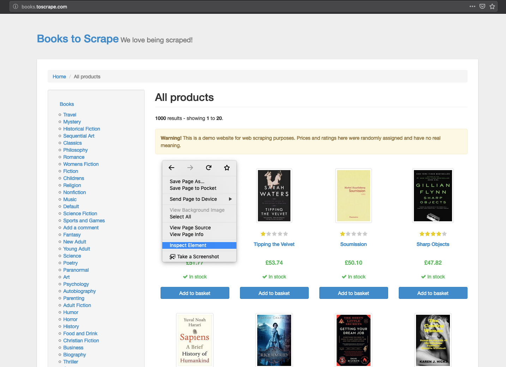
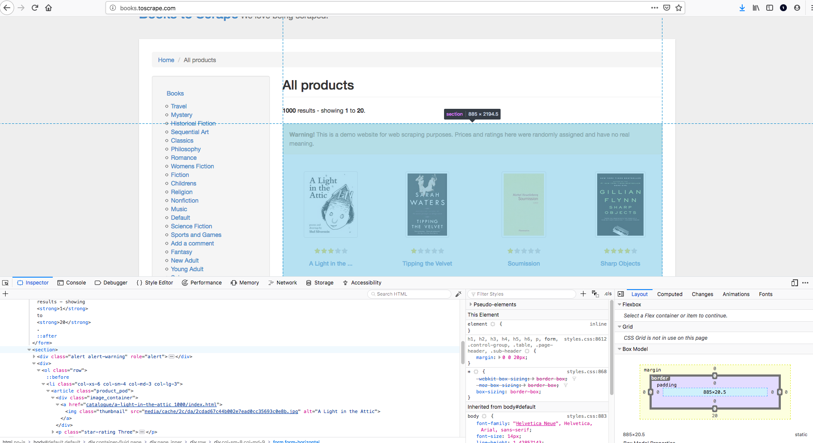
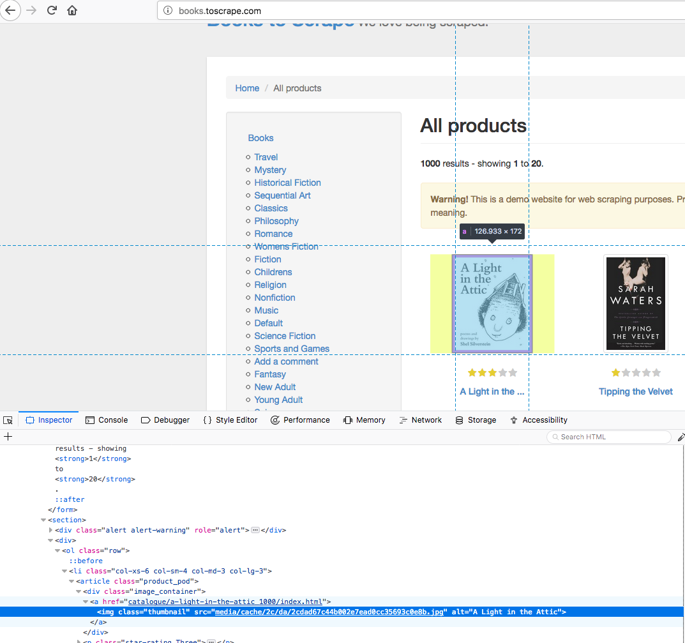

# Beautiful Soup in Practice

## Introduction

Now that you've gotten a brief introduction to Beautiful Soup and how to select various elements from a web page, its time to practice a hands on case of scraping a website. You'll start to see that scraping is a dynamic process that involves investigating the web page(s) at hand and developing scripts tailored to those structures.

## Objectives

You will be able to:

* Load an arbitrary into Beautiful Soup
* Use inspect element to find unique identifiers for elements of interest
* Navigate HTML documents using Beautiful Soup's children and sibling relations


```python
from bs4 import BeautifulSoup
import requests
```

## Grabbing an HTML Page

To start, here's how to retrieve an arbitrary web page and load it's content into Beautiful Soup for parsing. You first use the requests package to pull the html itself and then pass that data to beautiful soup.


```python
html_page = requests.get('http://books.toscrape.com/') #Make a get request to retrieve the page
soup = BeautifulSoup(html_page.content, 'html.parser') #Pass the page contents to beautiful soup for parsing
```

## Previewing the Structure

While it's apt to be too much information to effectively navigate, taking a quick peek into the structure of the HTML page is always a good idea.


```python
soup.prettify
```


    <bound method Tag.prettify of <!DOCTYPE html>
    
    <!--[if lt IE 7]>      <html lang="en-us" class="no-js lt-ie9 lt-ie8 lt-ie7"> <![endif]-->
    <!--[if IE 7]>         <html lang="en-us" class="no-js lt-ie9 lt-ie8"> <![endif]-->
    <!--[if IE 8]>         <html lang="en-us" class="no-js lt-ie9"> <![endif]-->
    <!--[if gt IE 8]><!--> <html class="no-js" lang="en-us"> <!--<![endif]-->
    <head>
    <title>
        All products | Books to Scrape - Sandbox
    </title>
    <meta content="text/html; charset=utf-8" http-equiv="content-type"/>
    <meta content="24th Jun 2016 09:29" name="created"/>
    <meta content="" name="description"/>
    <meta content="width=device-width" name="viewport"/>
    <meta content="NOARCHIVE,NOCACHE" name="robots"/>
    <!-- Le HTML5 shim, for IE6-8 support of HTML elements -->
    <!--[if lt IE 9]>
            <script src="//html5shim.googlecode.com/svn/trunk/html5.js"></script>
            <![endif]-->
    <link href="static/oscar/favicon.ico" rel="shortcut icon"/>
    <link href="static/oscar/css/styles.css" rel="stylesheet" type="text/css"/>
    <link href="static/oscar/js/bootstrap-datetimepicker/bootstrap-datetimepicker.css" rel="stylesheet"/>
    <link href="static/oscar/css/datetimepicker.css" rel="stylesheet" type="text/css"/>
    </head>
    <body class="default" id="default">
    <header class="header container-fluid">
    <div class="page_inner">
    <div class="row">
    <div class="col-sm-8 h1"><a href="index.html">Books to Scrape</a><small> We love being scraped!</small>
    </div>
    </div>
    </div>
    </header>
    <div class="container-fluid page">
    <div class="page_inner">
    <ul class="breadcrumb">
    <li>
    <a href="index.html">Home</a>
    </li>
    <li class="active">All products</li>
    </ul>
    <div class="row">
    <aside class="sidebar col-sm-4 col-md-3">
    <div id="promotions_left">
    </div>
    <div class="side_categories">
    <ul class="nav nav-list">
    <li>
    <a href="catalogue/category/books_1/index.html">
                                
                                    Books
                                
                            </a>
    <ul>
    <li>
    <a href="catalogue/category/books/travel_2/index.html">
                                
                                    Travel
                                
                            </a>
    </li>
    <li>
    <a href="catalogue/category/books/mystery_3/index.html">
                                
                                    Mystery
                                
                            </a>
    </li>
    <li>
    <a href="catalogue/category/books/historical-fiction_4/index.html">
                                
                                    Historical Fiction
                                
                            </a>
    </li>
    <li>
    <a href="catalogue/category/books/sequential-art_5/index.html">
                                
                                    Sequential Art
                                
                            </a>
    </li>
    <li>
    <a href="catalogue/category/books/classics_6/index.html">
                                
                                    Classics
                                
                            </a>
    </li>
    <li>
    <a href="catalogue/category/books/philosophy_7/index.html">
                                
                                    Philosophy
                                
                            </a>
    </li>
    <li>
    <a href="catalogue/category/books/romance_8/index.html">
                                
                                    Romance
                                
                            </a>
    </li>
    <li>
    <a href="catalogue/category/books/womens-fiction_9/index.html">
                                
                                    Womens Fiction
                                
                            </a>
    </li>
    <li>
    <a href="catalogue/category/books/fiction_10/index.html">
                                
                                    Fiction
                                
                            </a>
    </li>
    <li>
    <a href="catalogue/category/books/childrens_11/index.html">
                                
                                    Childrens
                                
                            </a>
    </li>
    <li>
    <a href="catalogue/category/books/religion_12/index.html">
                                
                                    Religion
                                
                            </a>
    </li>
    <li>
    <a href="catalogue/category/books/nonfiction_13/index.html">
                                
                                    Nonfiction
                                
                            </a>
    </li>
    <li>
    <a href="catalogue/category/books/music_14/index.html">
                                
                                    Music
                                
                            </a>
    </li>
    <li>
    <a href="catalogue/category/books/default_15/index.html">
                                
                                    Default
                                
                            </a>
    </li>
    <li>
    <a href="catalogue/category/books/science-fiction_16/index.html">
                                
                                    Science Fiction
                                
                            </a>
    </li>
    <li>
    <a href="catalogue/category/books/sports-and-games_17/index.html">
                                
                                    Sports and Games
                                
                            </a>
    </li>
    <li>
    <a href="catalogue/category/books/add-a-comment_18/index.html">
                                
                                    Add a comment
                                
                            </a>
    </li>
    <li>
    <a href="catalogue/category/books/fantasy_19/index.html">
                                
                                    Fantasy
                                
                            </a>
    </li>
    <li>
    <a href="catalogue/category/books/new-adult_20/index.html">
                                
                                    New Adult
                                
                            </a>
    </li>
    <li>
    <a href="catalogue/category/books/young-adult_21/index.html">
                                
                                    Young Adult
                                
                            </a>
    </li>
    <li>
    <a href="catalogue/category/books/science_22/index.html">
                                
                                    Science
                                
                            </a>
    </li>
    <li>
    <a href="catalogue/category/books/poetry_23/index.html">
                                
                                    Poetry
                                
                            </a>
    </li>
    <li>
    <a href="catalogue/category/books/paranormal_24/index.html">
                                
                                    Paranormal
                                
                            </a>
    </li>
    <li>
    <a href="catalogue/category/books/art_25/index.html">
                                
                                    Art
                                
                            </a>
    </li>
    <li>
    <a href="catalogue/category/books/psychology_26/index.html">
                                
                                    Psychology
                                
                            </a>
    </li>
    <li>
    <a href="catalogue/category/books/autobiography_27/index.html">
                                
                                    Autobiography
                                
                            </a>
    </li>
    <li>
    <a href="catalogue/category/books/parenting_28/index.html">
                                
                                    Parenting
                                
                            </a>
    </li>
    <li>
    <a href="catalogue/category/books/adult-fiction_29/index.html">
                                
                                    Adult Fiction
                                
                            </a>
    </li>
    <li>
    <a href="catalogue/category/books/humor_30/index.html">
                                
                                    Humor
                                
                            </a>
    </li>
    <li>
    <a href="catalogue/category/books/horror_31/index.html">
                                
                                    Horror
                                
                            </a>
    </li>
    <li>
    <a href="catalogue/category/books/history_32/index.html">
                                
                                    History
                                
                            </a>
    </li>
    <li>
    <a href="catalogue/category/books/food-and-drink_33/index.html">
                                
                                    Food and Drink
                                
                            </a>
    </li>
    <li>
    <a href="catalogue/category/books/christian-fiction_34/index.html">
                                
                                    Christian Fiction
                                
                            </a>
    </li>
    <li>
    <a href="catalogue/category/books/business_35/index.html">
                                
                                    Business
                                
                            </a>
    </li>
    <li>
    <a href="catalogue/category/books/biography_36/index.html">
                                
                                    Biography
                                
                            </a>
    </li>
    <li>
    <a href="catalogue/category/books/thriller_37/index.html">
                                
                                    Thriller
                                
                            </a>
    </li>
    <li>
    <a href="catalogue/category/books/contemporary_38/index.html">
                                
                                    Contemporary
                                
                            </a>
    </li>
    <li>
    <a href="catalogue/category/books/spirituality_39/index.html">
                                
                                    Spirituality
                                
                            </a>
    </li>
    <li>
    <a href="catalogue/category/books/academic_40/index.html">
                                
                                    Academic
                                
                            </a>
    </li>
    <li>
    <a href="catalogue/category/books/self-help_41/index.html">
                                
                                    Self Help
                                
                            </a>
    </li>
    <li>
    <a href="catalogue/category/books/historical_42/index.html">
                                
                                    Historical
                                
                            </a>
    </li>
    <li>
    <a href="catalogue/category/books/christian_43/index.html">
                                
                                    Christian
                                
                            </a>
    </li>
    <li>
    <a href="catalogue/category/books/suspense_44/index.html">
                                
                                    Suspense
                                
                            </a>
    </li>
    <li>
    <a href="catalogue/category/books/short-stories_45/index.html">
                                
                                    Short Stories
                                
                            </a>
    </li>
    <li>
    <a href="catalogue/category/books/novels_46/index.html">
                                
                                    Novels
                                
                            </a>
    </li>
    <li>
    <a href="catalogue/category/books/health_47/index.html">
                                
                                    Health
                                
                            </a>
    </li>
    <li>
    <a href="catalogue/category/books/politics_48/index.html">
                                
                                    Politics
                                
                            </a>
    </li>
    <li>
    <a href="catalogue/category/books/cultural_49/index.html">
                                
                                    Cultural
                                
                            </a>
    </li>
    <li>
    <a href="catalogue/category/books/erotica_50/index.html">
                                
                                    Erotica
                                
                            </a>
    </li>
    <li>
    <a href="catalogue/category/books/crime_51/index.html">
                                
                                    Crime
                                
                            </a>
    </li>
    </ul></li>
    </ul>
    </div>
    </aside>
    <div class="col-sm-8 col-md-9">
    <div class="page-header action">
    <h1>All products</h1>
    </div>
    <div id="messages">
    </div>
    <div id="promotions">
    </div>
    <form class="form-horizontal" method="get">
    <div style="display:none">
    </div>
    <strong>1000</strong> results - showing <strong>1</strong> to <strong>20</strong>.
                    
                
                
            
        </form>
    <section>
    <div class="alert alert-warning" role="alert"><strong>Warning!</strong> This is a demo website for web scraping purposes. Prices and ratings here were randomly assigned and have no real meaning.</div>
    <div>
    <ol class="row">
    <li class="col-xs-6 col-sm-4 col-md-3 col-lg-3">
    <article class="product_pod">
    <div class="image_container">
    <a href="catalogue/a-light-in-the-attic_1000/index.html"></a>
    </div>
    <p class="star-rating Three">
    <i class="icon-star"></i>
    <i class="icon-star"></i>
    <i class="icon-star"></i>
    <i class="icon-star"></i>
    <i class="icon-star"></i>
    </p>
    <h3><a href="catalogue/a-light-in-the-attic_1000/index.html" title="A Light in the Attic">A Light in the ...</a></h3>
    <div class="product_price">
    <p class="price_color">£51.77</p>
    <p class="instock availability">
    <i class="icon-ok"></i>
        
            In stock
        
    </p>
    <form>
    <button class="btn btn-primary btn-block" data-loading-text="Adding..." type="submit">Add to basket</button>
    </form>
    </div>
    </article>
    </li>
    <li class="col-xs-6 col-sm-4 col-md-3 col-lg-3">
    <article class="product_pod">
    <div class="image_container">
    <a href="catalogue/tipping-the-velvet_999/index.html"></a>
    </div>
    <p class="star-rating One">
    <i class="icon-star"></i>
    <i class="icon-star"></i>
    <i class="icon-star"></i>
    <i class="icon-star"></i>
    <i class="icon-star"></i>
    </p>
    <h3><a href="catalogue/tipping-the-velvet_999/index.html" title="Tipping the Velvet">Tipping the Velvet</a></h3>
    <div class="product_price">
    <p class="price_color">£53.74</p>
    <p class="instock availability">
    <i class="icon-ok"></i>
        
            In stock
        
    </p>
    <form>
    <button class="btn btn-primary btn-block" data-loading-text="Adding..." type="submit">Add to basket</button>
    </form>
    </div>
    </article>
    </li>
    <li class="col-xs-6 col-sm-4 col-md-3 col-lg-3">
    <article class="product_pod">
    <div class="image_container">
    <a href="catalogue/soumission_998/index.html"></a>
    </div>
    <p class="star-rating One">
    <i class="icon-star"></i>
    <i class="icon-star"></i>
    <i class="icon-star"></i>
    <i class="icon-star"></i>
    <i class="icon-star"></i>
    </p>
    <h3><a href="catalogue/soumission_998/index.html" title="Soumission">Soumission</a></h3>
    <div class="product_price">
    <p class="price_color">£50.10</p>
    <p class="instock availability">
    <i class="icon-ok"></i>
        
            In stock
        
    </p>
    <form>
    <button class="btn btn-primary btn-block" data-loading-text="Adding..." type="submit">Add to basket</button>
    </form>
    </div>
    </article>
    </li>
    <li class="col-xs-6 col-sm-4 col-md-3 col-lg-3">
    <article class="product_pod">
    <div class="image_container">
    <a href="catalogue/sharp-objects_997/index.html"></a>
    </div>
    <p class="star-rating Four">
    <i class="icon-star"></i>
    <i class="icon-star"></i>
    <i class="icon-star"></i>
    <i class="icon-star"></i>
    <i class="icon-star"></i>
    </p>
    <h3><a href="catalogue/sharp-objects_997/index.html" title="Sharp Objects">Sharp Objects</a></h3>
    <div class="product_price">
    <p class="price_color">£47.82</p>
    <p class="instock availability">
    <i class="icon-ok"></i>
        
            In stock
        
    </p>
    <form>
    <button class="btn btn-primary btn-block" data-loading-text="Adding..." type="submit">Add to basket</button>
    </form>
    </div>
    </article>
    </li>
    <li class="col-xs-6 col-sm-4 col-md-3 col-lg-3">
    <article class="product_pod">
    <div class="image_container">
    <a href="catalogue/sapiens-a-brief-history-of-humankind_996/index.html"></a>
    </div>
    <p class="star-rating Five">
    <i class="icon-star"></i>
    <i class="icon-star"></i>
    <i class="icon-star"></i>
    <i class="icon-star"></i>
    <i class="icon-star"></i>
    </p>
    <h3><a href="catalogue/sapiens-a-brief-history-of-humankind_996/index.html" title="Sapiens: A Brief History of Humankind">Sapiens: A Brief History ...</a></h3>
    <div class="product_price">
    <p class="price_color">£54.23</p>
    <p class="instock availability">
    <i class="icon-ok"></i>
        
            In stock
        
    </p>
    <form>
    <button class="btn btn-primary btn-block" data-loading-text="Adding..." type="submit">Add to basket</button>
    </form>
    </div>
    </article>
    </li>
    <li class="col-xs-6 col-sm-4 col-md-3 col-lg-3">
    <article class="product_pod">
    <div class="image_container">
    <a href="catalogue/the-requiem-red_995/index.html"></a>
    </div>
    <p class="star-rating One">
    <i class="icon-star"></i>
    <i class="icon-star"></i>
    <i class="icon-star"></i>
    <i class="icon-star"></i>
    <i class="icon-star"></i>
    </p>
    <h3><a href="catalogue/the-requiem-red_995/index.html" title="The Requiem Red">The Requiem Red</a></h3>
    <div class="product_price">
    <p class="price_color">£22.65</p>
    <p class="instock availability">
    <i class="icon-ok"></i>
        
            In stock
        
    </p>
    <form>
    <button class="btn btn-primary btn-block" data-loading-text="Adding..." type="submit">Add to basket</button>
    </form>
    </div>
    </article>
    </li>
    <li class="col-xs-6 col-sm-4 col-md-3 col-lg-3">
    <article class="product_pod">
    <div class="image_container">
    <a href="catalogue/the-dirty-little-secrets-of-getting-your-dream-job_994/index.html"></a>
    </div>
    <p class="star-rating Four">
    <i class="icon-star"></i>
    <i class="icon-star"></i>
    <i class="icon-star"></i>
    <i class="icon-star"></i>
    <i class="icon-star"></i>
    </p>
    <h3><a href="catalogue/the-dirty-little-secrets-of-getting-your-dream-job_994/index.html" title="The Dirty Little Secrets of Getting Your Dream Job">The Dirty Little Secrets ...</a></h3>
    <div class="product_price">
    <p class="price_color">£33.34</p>
    <p class="instock availability">
    <i class="icon-ok"></i>
        
            In stock
        
    </p>
    <form>
    <button class="btn btn-primary btn-block" data-loading-text="Adding..." type="submit">Add to basket</button>
    </form>
    </div>
    </article>
    </li>
    <li class="col-xs-6 col-sm-4 col-md-3 col-lg-3">
    <article class="product_pod">
    <div class="image_container">
    <a href="catalogue/the-coming-woman-a-novel-based-on-the-life-of-the-infamous-feminist-victoria-woodhull_993/index.html"></a>
    </div>
    <p class="star-rating Three">
    <i class="icon-star"></i>
    <i class="icon-star"></i>
    <i class="icon-star"></i>
    <i class="icon-star"></i>
    <i class="icon-star"></i>
    </p>
    <h3><a href="catalogue/the-coming-woman-a-novel-based-on-the-life-of-the-infamous-feminist-victoria-woodhull_993/index.html" title="The Coming Woman: A Novel Based on the Life of the Infamous Feminist, Victoria Woodhull">The Coming Woman: A ...</a></h3>
    <div class="product_price">
    <p class="price_color">£17.93</p>
    <p class="instock availability">
    <i class="icon-ok"></i>
        
            In stock
        
    </p>
    <form>
    <button class="btn btn-primary btn-block" data-loading-text="Adding..." type="submit">Add to basket</button>
    </form>
    </div>
    </article>
    </li>
    <li class="col-xs-6 col-sm-4 col-md-3 col-lg-3">
    <article class="product_pod">
    <div class="image_container">
    <a href="catalogue/the-boys-in-the-boat-nine-americans-and-their-epic-quest-for-gold-at-the-1936-berlin-olympics_992/index.html"></a>
    </div>
    <p class="star-rating Four">
    <i class="icon-star"></i>
    <i class="icon-star"></i>
    <i class="icon-star"></i>
    <i class="icon-star"></i>
    <i class="icon-star"></i>
    </p>
    <h3><a href="catalogue/the-boys-in-the-boat-nine-americans-and-their-epic-quest-for-gold-at-the-1936-berlin-olympics_992/index.html" title="The Boys in the Boat: Nine Americans and Their Epic Quest for Gold at the 1936 Berlin Olympics">The Boys in the ...</a></h3>
    <div class="product_price">
    <p class="price_color">£22.60</p>
    <p class="instock availability">
    <i class="icon-ok"></i>
        
            In stock
        
    </p>
    <form>
    <button class="btn btn-primary btn-block" data-loading-text="Adding..." type="submit">Add to basket</button>
    </form>
    </div>
    </article>
    </li>
    <li class="col-xs-6 col-sm-4 col-md-3 col-lg-3">
    <article class="product_pod">
    <div class="image_container">
    <a href="catalogue/the-black-maria_991/index.html"></a>
    </div>
    <p class="star-rating One">
    <i class="icon-star"></i>
    <i class="icon-star"></i>
    <i class="icon-star"></i>
    <i class="icon-star"></i>
    <i class="icon-star"></i>
    </p>
    <h3><a href="catalogue/the-black-maria_991/index.html" title="The Black Maria">The Black Maria</a></h3>
    <div class="product_price">
    <p class="price_color">£52.15</p>
    <p class="instock availability">
    <i class="icon-ok"></i>
        
            In stock
        
    </p>
    <form>
    <button class="btn btn-primary btn-block" data-loading-text="Adding..." type="submit">Add to basket</button>
    </form>
    </div>
    </article>
    </li>
    <li class="col-xs-6 col-sm-4 col-md-3 col-lg-3">
    <article class="product_pod">
    <div class="image_container">
    <a href="catalogue/starving-hearts-triangular-trade-trilogy-1_990/index.html"></a>
    </div>
    <p class="star-rating Two">
    <i class="icon-star"></i>
    <i class="icon-star"></i>
    <i class="icon-star"></i>
    <i class="icon-star"></i>
    <i class="icon-star"></i>
    </p>
    <h3><a href="catalogue/starving-hearts-triangular-trade-trilogy-1_990/index.html" title="Starving Hearts (Triangular Trade Trilogy, #1)">Starving Hearts (Triangular Trade ...</a></h3>
    <div class="product_price">
    <p class="price_color">£13.99</p>
    <p class="instock availability">
    <i class="icon-ok"></i>
        
            In stock
        
    </p>
    <form>
    <button class="btn btn-primary btn-block" data-loading-text="Adding..." type="submit">Add to basket</button>
    </form>
    </div>
    </article>
    </li>
    <li class="col-xs-6 col-sm-4 col-md-3 col-lg-3">
    <article class="product_pod">
    <div class="image_container">
    <a href="catalogue/shakespeares-sonnets_989/index.html"></a>
    </div>
    <p class="star-rating Four">
    <i class="icon-star"></i>
    <i class="icon-star"></i>
    <i class="icon-star"></i>
    <i class="icon-star"></i>
    <i class="icon-star"></i>
    </p>
    <h3><a href="catalogue/shakespeares-sonnets_989/index.html" title="Shakespeare's Sonnets">Shakespeare's Sonnets</a></h3>
    <div class="product_price">
    <p class="price_color">£20.66</p>
    <p class="instock availability">
    <i class="icon-ok"></i>
        
            In stock
        
    </p>
    <form>
    <button class="btn btn-primary btn-block" data-loading-text="Adding..." type="submit">Add to basket</button>
    </form>
    </div>
    </article>
    </li>
    <li class="col-xs-6 col-sm-4 col-md-3 col-lg-3">
    <article class="product_pod">
    <div class="image_container">
    <a href="catalogue/set-me-free_988/index.html"></a>
    </div>
    <p class="star-rating Five">
    <i class="icon-star"></i>
    <i class="icon-star"></i>
    <i class="icon-star"></i>
    <i class="icon-star"></i>
    <i class="icon-star"></i>
    </p>
    <h3><a href="catalogue/set-me-free_988/index.html" title="Set Me Free">Set Me Free</a></h3>
    <div class="product_price">
    <p class="price_color">£17.46</p>
    <p class="instock availability">
    <i class="icon-ok"></i>
        
            In stock
        
    </p>
    <form>
    <button class="btn btn-primary btn-block" data-loading-text="Adding..." type="submit">Add to basket</button>
    </form>
    </div>
    </article>
    </li>
    <li class="col-xs-6 col-sm-4 col-md-3 col-lg-3">
    <article class="product_pod">
    <div class="image_container">
    <a href="catalogue/scott-pilgrims-precious-little-life-scott-pilgrim-1_987/index.html"></a>
    </div>
    <p class="star-rating Five">
    <i class="icon-star"></i>
    <i class="icon-star"></i>
    <i class="icon-star"></i>
    <i class="icon-star"></i>
    <i class="icon-star"></i>
    </p>
    <h3><a href="catalogue/scott-pilgrims-precious-little-life-scott-pilgrim-1_987/index.html" title="Scott Pilgrim's Precious Little Life (Scott Pilgrim #1)">Scott Pilgrim's Precious Little ...</a></h3>
    <div class="product_price">
    <p class="price_color">£52.29</p>
    <p class="instock availability">
    <i class="icon-ok"></i>
        
            In stock
        
    </p>
    <form>
    <button class="btn btn-primary btn-block" data-loading-text="Adding..." type="submit">Add to basket</button>
    </form>
    </div>
    </article>
    </li>
    <li class="col-xs-6 col-sm-4 col-md-3 col-lg-3">
    <article class="product_pod">
    <div class="image_container">
    <a href="catalogue/rip-it-up-and-start-again_986/index.html"></a>
    </div>
    <p class="star-rating Five">
    <i class="icon-star"></i>
    <i class="icon-star"></i>
    <i class="icon-star"></i>
    <i class="icon-star"></i>
    <i class="icon-star"></i>
    </p>
    <h3><a href="catalogue/rip-it-up-and-start-again_986/index.html" title="Rip it Up and Start Again">Rip it Up and ...</a></h3>
    <div class="product_price">
    <p class="price_color">£35.02</p>
    <p class="instock availability">
    <i class="icon-ok"></i>
        
            In stock
        
    </p>
    <form>
    <button class="btn btn-primary btn-block" data-loading-text="Adding..." type="submit">Add to basket</button>
    </form>
    </div>
    </article>
    </li>
    <li class="col-xs-6 col-sm-4 col-md-3 col-lg-3">
    <article class="product_pod">
    <div class="image_container">
    <a href="catalogue/our-band-could-be-your-life-scenes-from-the-american-indie-underground-1981-1991_985/index.html"></a>
    </div>
    <p class="star-rating Three">
    <i class="icon-star"></i>
    <i class="icon-star"></i>
    <i class="icon-star"></i>
    <i class="icon-star"></i>
    <i class="icon-star"></i>
    </p>
    <h3><a href="catalogue/our-band-could-be-your-life-scenes-from-the-american-indie-underground-1981-1991_985/index.html" title="Our Band Could Be Your Life: Scenes from the American Indie Underground, 1981-1991">Our Band Could Be ...</a></h3>
    <div class="product_price">
    <p class="price_color">£57.25</p>
    <p class="instock availability">
    <i class="icon-ok"></i>
        
            In stock
        
    </p>
    <form>
    <button class="btn btn-primary btn-block" data-loading-text="Adding..." type="submit">Add to basket</button>
    </form>
    </div>
    </article>
    </li>
    <li class="col-xs-6 col-sm-4 col-md-3 col-lg-3">
    <article class="product_pod">
    <div class="image_container">
    <a href="catalogue/olio_984/index.html"></a>
    </div>
    <p class="star-rating One">
    <i class="icon-star"></i>
    <i class="icon-star"></i>
    <i class="icon-star"></i>
    <i class="icon-star"></i>
    <i class="icon-star"></i>
    </p>
    <h3><a href="catalogue/olio_984/index.html" title="Olio">Olio</a></h3>
    <div class="product_price">
    <p class="price_color">£23.88</p>
    <p class="instock availability">
    <i class="icon-ok"></i>
        
            In stock
        
    </p>
    <form>
    <button class="btn btn-primary btn-block" data-loading-text="Adding..." type="submit">Add to basket</button>
    </form>
    </div>
    </article>
    </li>
    <li class="col-xs-6 col-sm-4 col-md-3 col-lg-3">
    <article class="product_pod">
    <div class="image_container">
    <a href="catalogue/mesaerion-the-best-science-fiction-stories-1800-1849_983/index.html"></a>
    </div>
    <p class="star-rating One">
    <i class="icon-star"></i>
    <i class="icon-star"></i>
    <i class="icon-star"></i>
    <i class="icon-star"></i>
    <i class="icon-star"></i>
    </p>
    <h3><a href="catalogue/mesaerion-the-best-science-fiction-stories-1800-1849_983/index.html" title="Mesaerion: The Best Science Fiction Stories 1800-1849">Mesaerion: The Best Science ...</a></h3>
    <div class="product_price">
    <p class="price_color">£37.59</p>
    <p class="instock availability">
    <i class="icon-ok"></i>
        
            In stock
        
    </p>
    <form>
    <button class="btn btn-primary btn-block" data-loading-text="Adding..." type="submit">Add to basket</button>
    </form>
    </div>
    </article>
    </li>
    <li class="col-xs-6 col-sm-4 col-md-3 col-lg-3">
    <article class="product_pod">
    <div class="image_container">
    <a href="catalogue/libertarianism-for-beginners_982/index.html"></a>
    </div>
    <p class="star-rating Two">
    <i class="icon-star"></i>
    <i class="icon-star"></i>
    <i class="icon-star"></i>
    <i class="icon-star"></i>
    <i class="icon-star"></i>
    </p>
    <h3><a href="catalogue/libertarianism-for-beginners_982/index.html" title="Libertarianism for Beginners">Libertarianism for Beginners</a></h3>
    <div class="product_price">
    <p class="price_color">£51.33</p>
    <p class="instock availability">
    <i class="icon-ok"></i>
        
            In stock
        
    </p>
    <form>
    <button class="btn btn-primary btn-block" data-loading-text="Adding..." type="submit">Add to basket</button>
    </form>
    </div>
    </article>
    </li>
    <li class="col-xs-6 col-sm-4 col-md-3 col-lg-3">
    <article class="product_pod">
    <div class="image_container">
    <a href="catalogue/its-only-the-himalayas_981/index.html"></a>
    </div>
    <p class="star-rating Two">
    <i class="icon-star"></i>
    <i class="icon-star"></i>
    <i class="icon-star"></i>
    <i class="icon-star"></i>
    <i class="icon-star"></i>
    </p>
    <h3><a href="catalogue/its-only-the-himalayas_981/index.html" title="It's Only the Himalayas">It's Only the Himalayas</a></h3>
    <div class="product_price">
    <p class="price_color">£45.17</p>
    <p class="instock availability">
    <i class="icon-ok"></i>
        
            In stock
        
    </p>
    <form>
    <button class="btn btn-primary btn-block" data-loading-text="Adding..." type="submit">Add to basket</button>
    </form>
    </div>
    </article>
    </li>
    </ol>
    <div>
    <ul class="pager">
    <li class="current">
                
                    Page 1 of 50
                
                </li>
    <li class="next"><a href="catalogue/page-2.html">next</a></li>
    </ul>
    </div>
    </div>
    </section>
    </div>
    </div><!-- /row -->
    </div><!-- /page_inner -->
    </div><!-- /container-fluid -->
    <footer class="footer container-fluid">
    </footer>
    <!-- jQuery -->
    <script src="http://ajax.googleapis.com/ajax/libs/jquery/1.9.1/jquery.min.js"></script>
    <script>window.jQuery || document.write('<script src="static/oscar/js/jquery/jquery-1.9.1.min.js"><\/script>')</script>
    <!-- Twitter Bootstrap -->
    <script src="static/oscar/js/bootstrap3/bootstrap.min.js" type="text/javascript"></script>
    <!-- Oscar -->
    <script charset="utf-8" src="static/oscar/js/oscar/ui.js" type="text/javascript"></script>
    <script charset="utf-8" src="static/oscar/js/bootstrap-datetimepicker/bootstrap-datetimepicker.js" type="text/javascript"></script>
    <script charset="utf-8" src="static/oscar/js/bootstrap-datetimepicker/locales/bootstrap-datetimepicker.all.js" type="text/javascript"></script>
    <script type="text/javascript">
                $(function() {
                    
        
        
        oscar.init();
    
        oscar.search.init();
    
                });
            </script>
    <!-- Version: N/A -->
    </body>
    </html>
    >


## Using the Inspect Element Feature

As you can see, there's a lot going on in a production level HTML page. Rather than tediously scrolling through all of this, you'll typically have specific information you're looking to pull from a page. For example, the page you've just loaded is a mock online bookstore used for scraping practice. (As noted in the previous lesson, be careful what you attempt to scrape and at what rate/volume; many websites will quickly blacklist you if you attempt to make too many requests.) For this page, you'll see how to programmatically extract the book names, cover images, and price. Once you have a goal in mind, you can ctrl+click (Windows: right click) on the portion of the page that you're interested in and select inspect element. This will bring up the developer's portion of your web broswer and allow you to preview the underlying html code.




```python
ls images
```

    DOM-model.svg.png  book-section.png   pager.png
    azlyrics_images/   book_img.png       sidebar.png


This will also reveal underlying `divs`, `headers` and other containers the web designers have used to organize their web pages.




## Selecting a Container
